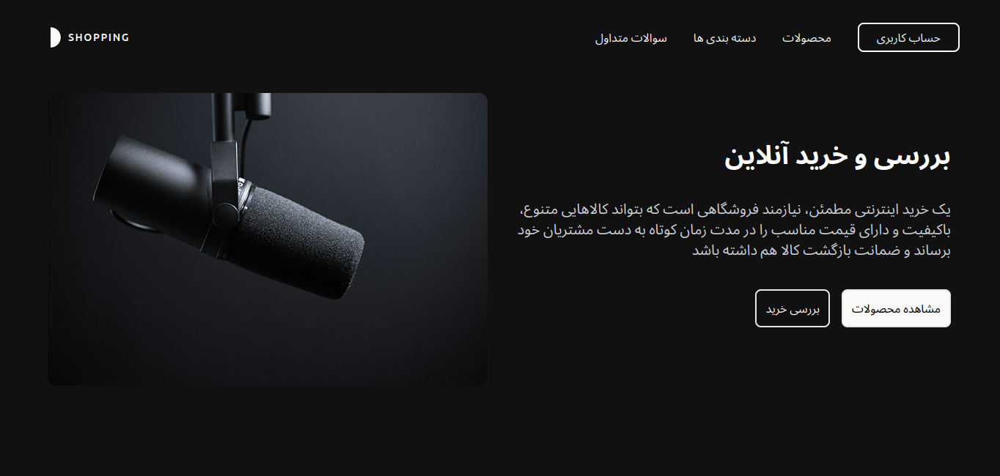

# Tailwind CSS Storefront Homepage

A practice project for designing the homepage of a studio equipment storefront using **Tailwind CSS**.

## Features  
- Modern and responsive design  
- Built with **Tailwind CSS** for fast and efficient styling  
- Simple, minimalistic homepage layout  

## Preview  
### Intro Section  
  


## How to Use  
1. Clone the repository:  
   ```bash
   git clone https://github.com/Mr0Hadi/Tailwind-Project.git
   ```  
2. Install dependencies:  
   ```bash
   npm install
   ```  
3. Start the development server:  
   ```bash
   npm run dev
   ```  

## Purpose  
To practice building a professional UI using modern web tools.

---  